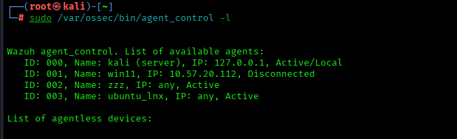
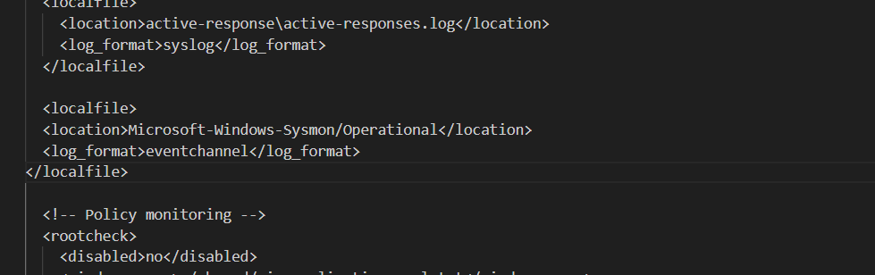
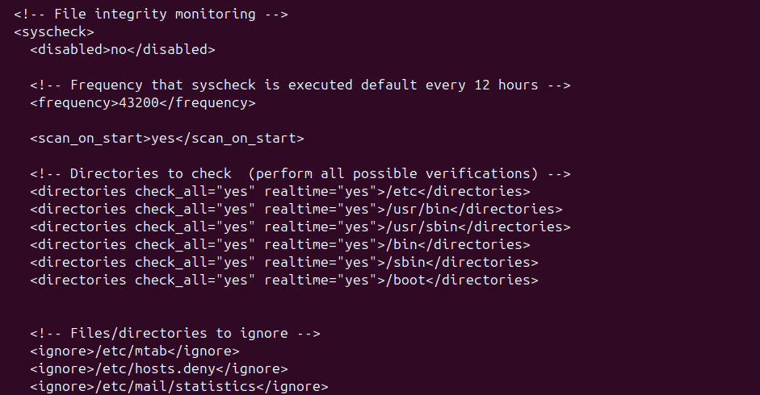
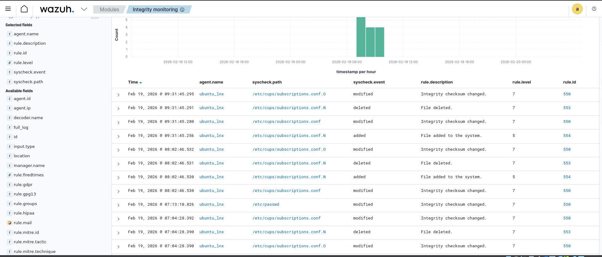
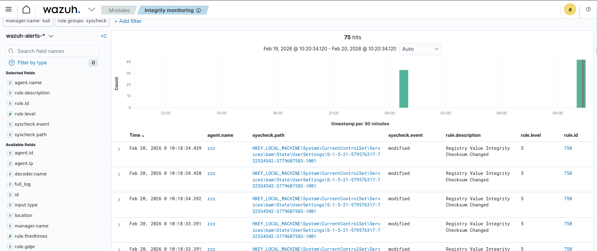
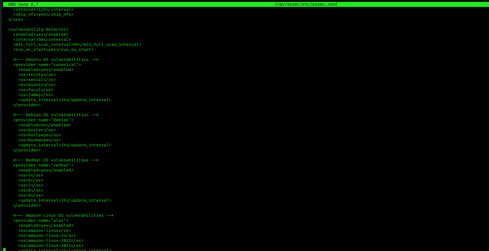

# 🛡 Security Operations (SOC) -- Enterprise EDR & Threat Hunting Grid

This project demonstrates the implementation of a simulated enterprise
Security Operations Center (SOC) environment using Wazuh for endpoint
detection, file integrity monitoring, and vulnerability assessment
across Linux and Windows systems.

------------------------------------------------------------------------
# 🛡 Enterprise EDR & Threat Hunting Grid -- Sentient Shield

## 📌 Project Overview

This project demonstrates the design and implementation of a centralized
SOC (Security Operations Center) lab using Wazuh SIEM with multiple
agents.

The lab simulates real-world cyber attack scenarios and showcases
detection, monitoring, and automated response capabilities in a
multi-agent enterprise-style environment.

------------------------------------------------------------------------

# 🏗 Lab Architecture

  Component      Role
  -------------- ---------------
  Kali Linux     Wazuh Manager
  Windows 11     Wazuh Agent
  Ubuntu server   Wazuh Agent

All systems are configured in **Bridged Network Mode** to simulate a
real enterprise network. Ensured agents communicate with manager over TCP 1514.
------------------------------------------------------------------------
# 📅 Week 1 -- Infrastructure & Agent Deployment

# 🔧 Technologies Used

-   Wazuh (SIEM & EDR)
-   Sysmon (Windows Advanced Monitoring)
-   Hydra (Brute-force Simulation)
-   Kali Linux
-   Ubuntu
-   Windows 10
-   MITRE ATT&CK Framework

## 🔎 Visibility Setup

-   Enabled system log monitoring on both agents.
-   Verified log ingestion from Linux and Windows.
-   Confirmed heartbeat communication between agents and manager.

## 🚪 Gate Check

✔ All agents show "Active" status in the Wazuh Dashboard.\
✔ Heartbeat signals are stable.\
✔ Initial logs are successfully collected and indexed.

 ⚙ Configuration

Sysmon installed using:

 $ Sysmon64.exe -accepteula -i sysmonconfig.xml

Wazuh agent configuration updated:

<localfile>
  <location>Microsoft-Windows-Sysmon/Operational</location>
  <log_format>eventchannel</log_format>
</localfile>

Wazuh agent service restarted after configuration.

✅ Week 1 Status: COMPLETED

------------------------------------------------------------------------

# 📅 Week 2 -- Detection Rules (The Logic)

## 🔍 File Integrity Monitoring (FIM)

-   Monitored critical directories (/etc)
-   Detected unauthorized modifications
-   Generated real-time alerts

Configured FIM (syscheck) to monitor sensitive directories in real-time.

Configuration includes: - check_all="yes" - realtime="yes"

------------------------------------------------------------------------

## 🐧 Ubuntu FIM Testing

### Test Performed

-   Created a test script file in monitored directory.
-   Modified the file manually.
-   Observed real-time alert generation.

File location:
/var/ossec/etc/ossec.conf

Inside <syscheck> section, the following configuration was added:

<directories check_all="yes" realtime="yes">/etc/passwd</directories>
<directories check_all="yes" realtime="yes">/etc/shadow</directories>
<directories check_all="yes" realtime="yes">/etc/group</directories>

<directories check_all="yes" realtime="yes">/etc</directories>
<directories check_all="yes" realtime="yes">/usr/bin</directories>
<directories check_all="yes" realtime="yes">/bin</directories>

After updating configuration:
sudo systemctl restart wazuh-agent

---

### Result

Test command used:
sudo nano /etc/passwd

Result:
- File modified alert triggered
- Integrity checksum changed
- Real-time detection confirmed

--- 

# Viewing FIM Alerts in Dashboard

Navigate to:
Wazuh → Security Events

Search filter:
rule.groups:syscheck

or
Dashboard → Modules → Intergrity monitering

---

------------------------------------------------------------------------

## 🪟 Windows FIM Testing

### Test Performed

-   Created/modified a monitored file on Windows system.
-   Observed alert in Wazuh dashboard.

Configured directory: C:\Program Files (x86)\ossec-agent\ossec.conf

<directories check_all="yes" realtime="yes">C:\Windows\System32\drivers\etc</directories>

### Result

-   Real-time file modification alert triggered successfully.

 

------------------------------------------------------------------------

## 🚨 Vulnerability Detection

Enabled the Vulnerability Detector module.

### Configuration

-   Canonical provider enabled (Ubuntu)
-   MSU provider enabled (Windows)
-   Automatic CVE database updates configured
-   Periodic scanning enabled

### Capabilities Achieved
-   Detects installed vulnerable packages
-   Maps software versions to CVE database
-   Displays:
    -   CVE ID
    -   Severity Level
    -   Affected Package
    -   Fixed Version

<enabled>no</enabled>            -->          <enabled>yes</enabled>

same for windows & OS ubuntu OS 

------------------------------------------------------------------------

## 🚪 Gate Check

✔ Manually modified a file in a monitored FIM directory.\
✔ High-severity alert appeared in dashboard within seconds.\
✔ Vulnerability Detector successfully enabled.\

✅ Week 2 Status: COMPLETED

------------------------------------------------------------------------
