# 🛡 Security Operations (SOC) -- Enterprise EDR & Threat Hunting Grid

This project demonstrates the implementation of a simulated enterprise
Security Operations Center (SOC) environment using Wazuh for 

------------------------------------------------------------------------

## 📌 Project Overview

This project demonstrates the design and implementation of a centralized
SOC (Security Operations Center) lab using Wazuh for agents endpoint 
detection, file integrity monitoring, and vulnerability assessment
across Linux and Windows systems.


------------------------------------------------------------------------

# 🏗 Lab Architecture
```
  Component            Role
  --------------    ---------------
  Kali Linux           Wazuh Manager
  Windows 11(zzz)      Wazuh Agent 
  Ubuntu server        Wazuh Agent
```
All systems are configured in **Bridged Network Mode** to simulate a
real enterprise network. Ensured agents communicate with manager over TCP 1514.
------------------------------------------------------------------------
# 📅 Week 1 -- Infrastructure & Agent Deployment

# 🔧 Technologies Used

-   Wazuh (SIEM & EDR)
-   Sysmon (Windows Advanced Monitoring)
-   Hydra (Brute-force Simulation)
-   Kali Linux
-   Ubuntu
-   Windows 10
-   MITRE ATT&CK Framework


## 🔎 Visibility Setup

-   Enabled system log monitoring on both agents.
-   Verified log ingestion from Linux and Windows.
-   Confirmed heartbeat communication between agents and manager.

## 🚪 Gate Check

✔ All agents show "Active" status in the Wazuh Dashboard.\
✔ Heartbeat signals are stable.\
✔ Initial logs are successfully collected and indexed.


 ⚙ Configuration

Sysmon installed using:

 $ Sysmon64.exe -accepteula -i sysmonconfig.xml

Wazuh agent configuration updated:

```xml
<localfile>
  <location>Microsoft-Windows-Sysmon/Operational</location>
  <log_format>eventchannel</log_format>
</localfile>
```

Wazuh agent service restarted after configuration.


## Sysmon Detection Results

After integration, multiple high-fidelity security alerts were generated and validated.
🔍 Observed Detections

Suspicious execution of whoami.exe
Executable dropped in Windows root directory
Abnormal Command Prompt parent process
PowerShell execution monitoring
Application Compatibility Database activity
Several alerts triggered at Level 12 (High Severity).

This confirms:
Proper rule decoding
Command-line visibility
Parent-child process tracking
Suspicious behavior detection

 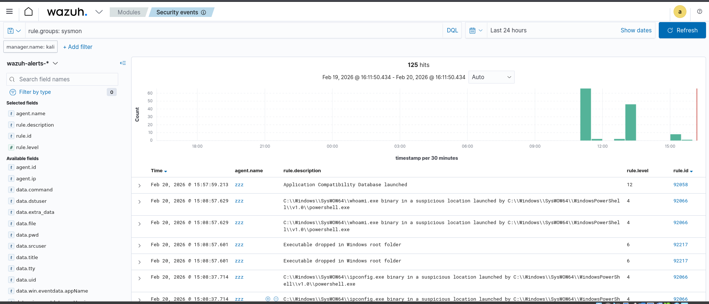
 
✅ Week 1 Status: COMPLETED

------------------------------------------------------------------------

# 📅 Week 2 -- Detection Rules (The Logic)

## 🔍 File Integrity Monitoring (FIM)

-   Monitored critical directories (/etc)
-   Detected unauthorized modifications
-   Generated real-time alerts

Configured FIM (syscheck) to monitor sensitive directories in real-time.

Configuration includes: - check_all="yes" - realtime="yes"

------------------------------------------------------------------------

## 🐧 Ubuntu FIM Testing

### Test Performed

-   Created a test script file in monitored directory.
-   Modified the file manually.
-   Observed real-time alert generation.

File location:
/var/ossec/etc/ossec.conf

Inside <syscheck> section, the following configuration was added:

<directories check_all="yes" realtime="yes">/etc/passwd</directories>
<directories check_all="yes" realtime="yes">/etc/shadow</directories>
<directories check_all="yes" realtime="yes">/etc/group</directories>

<directories check_all="yes" realtime="yes">/etc</directories>
<directories check_all="yes" realtime="yes">/usr/bin</directories>
<directories check_all="yes" realtime="yes">/bin</directories>

After updating configuration:
sudo systemctl restart wazuh-agent


---

### Result

Test command used:
sudo nano /etc/passwd

Result:
- File modified alert triggered
- Integrity checksum changed
- Real-time detection confirmed


--- 

# Viewing FIM Alerts in Dashboard

Navigate to:
Wazuh → Security Events

Search filter:
rule.groups:syscheck

or
Dashboard → Modules → Intergrity monitering


---

------------------------------------------------------------------------

## 🪟 Windows FIM Testing

### Test Performed

-   Created/modified a monitored file on Windows system.
-   Observed alert in Wazuh dashboard.

Configured directory: C:\Program Files (x86)\ossec-agent\ossec.conf

<directories check_all="yes" realtime="yes">C:\Windows\System32\drivers\etc</directories>


### Result

-   Real-time file modification alert triggered successfully.

 


------------------------------------------------------------------------

## 🚨 Vulnerability Detection

Enabled the Vulnerability Detector module.

### Configuration

-   Canonical provider enabled (Ubuntu)
-   MSU provider enabled (Windows)
-   Automatic CVE database updates configured
-   Periodic scanning enabled


### Capabilities Achieved
-   Detects installed vulnerable packages
-   Maps software versions to CVE database
-   Displays:
    -   CVE ID
    -   Severity Level
    -   Affected Package
    -   Fixed Version
```xml
<enabled>no</enabled>            -->          <enabled>yes</enabled>
```
same for windows & ubuntu OS 


then manually  installed vulnerable software.
we used apache2.
Vulnerabilities detected and alerted.


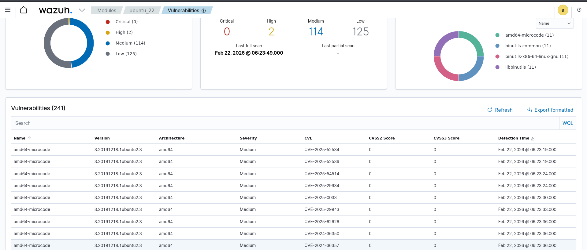 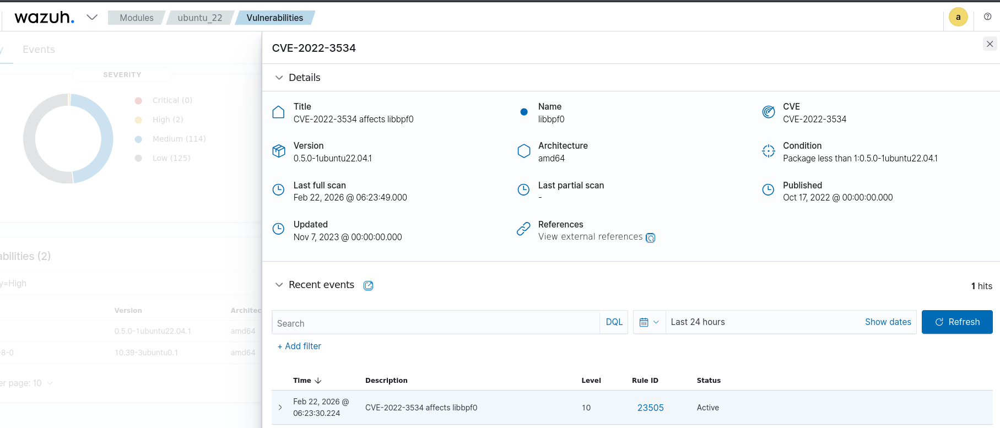


------------------------------------------------------------------------

## 🚪 Gate Check

✔ Manually modified a file in a monitored FIM directory.\
✔ High-severity alert appeared in dashboard within seconds.\
✔ Vulnerability Detector successfully enabled.\

✅ Week 2 Status: COMPLETED

------------------------------------------------------------------------
Week 3 – Active Response (Intrusion Prevention System)


🎯 Objective

To configure and verify an Intrusion Prevention System (IPS) using Wazuh. The goal is to detect an SSH brute-force attack and automatically trigger a firewall block on the target host (ubuntu_22) to mitigate the threat in real-time.

------------------------------------------------------------------------

🔍 Configuration Details
The active response was configured on the Wazuh Manager in the /var/ossec/etc/ossec.conf file.

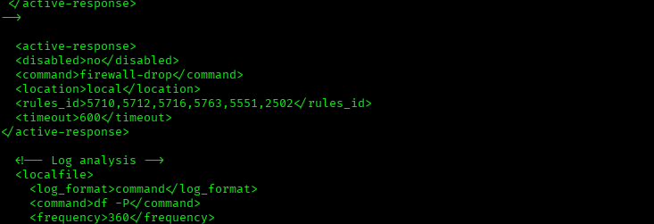

⚙️ Active Response Setup
The following parameters were defined to ensure the manager commands the agent to drop malicious traffic:

Command: firewall-drop (utilizes the host's local firewall to block IPs).

Location: local (executes the response on the specific agent that generated the alert).

Timeout: 600 seconds (the IP is unbanned automatically after 10 minutes).

Targeted Rule IDs
To catch the brute force attack effectively, the following rules were monitored:

5760: SSHD authentication failed.

5758: Maximum authentication attempts exceeded.

40111: Multiple authentication failures (Trigger Rule).

2502: Syslog: User missed the password more than once.

------------------------------------------------------------------------


🧪 Attack Simulation & Verification 
An SSH brute-force attack was simulated using Hydra against the Ubuntu SSH service.

$ hydra -l root -P passwords.txt ssh://agent-ip

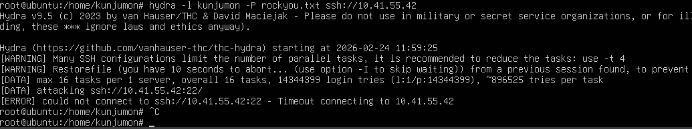

## 🚪 Gate Check

Manual Verification on Target Host
To confirm the IPS worked at the system level, the following checks were performed on the ubuntu_22 agent:

A. Active Response Logs
Verified that the script executed successfully by checking the agent's local log:

$ tail -n 5 /var/ossec/logs/active-responses.log

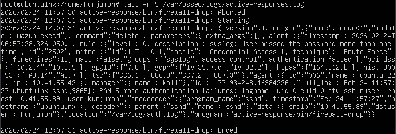 

Result: The log confirmed the firewall-drop.sh script was called with the add argument for the attacker's IP.

B. Firewall Rules (iptables)
Verified that the IP was added to the kernel routing table:

$ sudo iptables -L -n

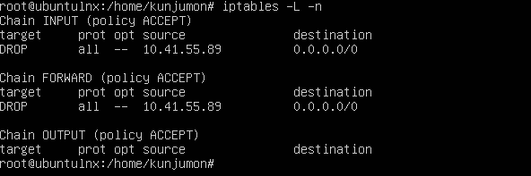

Result: Confirmed a DROP rule in the INPUT chain for the attacker's source IP.

Output:

DROP  all  --  10.41.55.89       0.0.0.0/0


C. SSH brute-force alerts observed in Wazuh Dashboard
Active Response event logged:
“Host Blocked by firewall-drop Active Response”
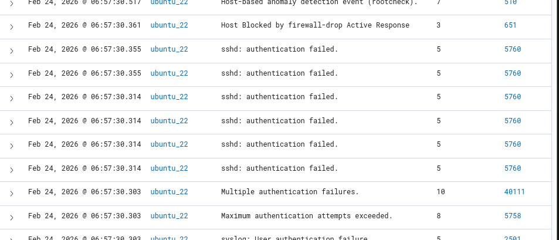


------------------------------------------------------------------------

🧠 Troubleshooting & Lessons Learned

XML Formatting: Initially, the configuration was placed inside XML comment tags (``), causing it to be ignored by the manager. Removing these tags and restarting the wazuh-manager service resolved the issue.


Higher-level rules (e.g., Level 10) are effective triggers for IPS behavior
Wazuh can function as an automated Intrusion Prevention System (IPS)

Accurate rule selection is critical for proper response execution


🚀 Result

Successfully implemented automated SSH brute-force mitigation using Wazuh Active Response.

Week 3: ✅ Completed
<<<<<<< HEAD
# 🛡 Security Operations (SOC) -- Enterprise EDR & Threat Hunting Grid

This project demonstrates the implementation of a simulated enterprise
Security Operations Center (SOC) environment using Wazuh for 

------------------------------------------------------------------------

## 📌 Project Overview

This project demonstrates the design and implementation of a centralized
SOC (Security Operations Center) lab using Wazuh for agents endpoint 
detection, file integrity monitoring, and vulnerability assessment
across Linux and Windows systems.


------------------------------------------------------------------------

# 🏗 Lab Architecture
```
  Component            Role
  --------------    ---------------
  Kali Linux           Wazuh Manager
  Windows 11(zzz)      Wazuh Agent 
  Ubuntu server        Wazuh Agent
```
All systems are configured in **Bridged Network Mode** to simulate a
real enterprise network. Ensured agents communicate with manager over TCP 1514.
------------------------------------------------------------------------
# 📅 Week 1 -- Infrastructure & Agent Deployment

# 🔧 Technologies Used

-   Wazuh (SIEM & EDR)
-   Sysmon (Windows Advanced Monitoring)
-   Hydra (Brute-force Simulation)
-   Kali Linux
-   Ubuntu
-   Windows 10
-   MITRE ATT&CK Framework


## 🔎 Visibility Setup

-   Enabled system log monitoring on both agents.
-   Verified log ingestion from Linux and Windows.
-   Confirmed heartbeat communication between agents and manager.

## 🚪 Gate Check

✔ All agents show "Active" status in the Wazuh Dashboard.\
✔ Heartbeat signals are stable.\
✔ Initial logs are successfully collected and indexed.


 ⚙ Configuration

Sysmon installed using:

 $ Sysmon64.exe -accepteula -i sysmonconfig.xml

Wazuh agent configuration updated:

```xml
<localfile>
  <location>Microsoft-Windows-Sysmon/Operational</location>
  <log_format>eventchannel</log_format>
</localfile>
```

Wazuh agent service restarted after configuration.


## Sysmon Detection Results

After integration, multiple high-fidelity security alerts were generated and validated.
🔍 Observed Detections

Suspicious execution of whoami.exe
Executable dropped in Windows root directory
Abnormal Command Prompt parent process
PowerShell execution monitoring
Application Compatibility Database activity
Several alerts triggered at Level 12 (High Severity).

This confirms:
Proper rule decoding
Command-line visibility
Parent-child process tracking
Suspicious behavior detection

 
 
✅ Week 1 Status: COMPLETED

------------------------------------------------------------------------

# 📅 Week 2 -- Detection Rules (The Logic)

## 🔍 File Integrity Monitoring (FIM)

-   Monitored critical directories (/etc)
-   Detected unauthorized modifications
-   Generated real-time alerts

Configured FIM (syscheck) to monitor sensitive directories in real-time.

Configuration includes: - check_all="yes" - realtime="yes"

------------------------------------------------------------------------

## 🐧 Ubuntu FIM Testing

### Test Performed

-   Created a test script file in monitored directory.
-   Modified the file manually.
-   Observed real-time alert generation.

File location:
/var/ossec/etc/ossec.conf

Inside <syscheck> section, the following configuration was added:

<directories check_all="yes" realtime="yes">/etc/passwd</directories>
<directories check_all="yes" realtime="yes">/etc/shadow</directories>
<directories check_all="yes" realtime="yes">/etc/group</directories>

<directories check_all="yes" realtime="yes">/etc</directories>
<directories check_all="yes" realtime="yes">/usr/bin</directories>
<directories check_all="yes" realtime="yes">/bin</directories>

After updating configuration:
sudo systemctl restart wazuh-agent


---

### Result

Test command used:
sudo nano /etc/passwd

Result:
- File modified alert triggered
- Integrity checksum changed
- Real-time detection confirmed


--- 

# Viewing FIM Alerts in Dashboard

Navigate to:
Wazuh → Security Events

Search filter:
rule.groups:syscheck

or
Dashboard → Modules → Intergrity monitering


---

------------------------------------------------------------------------

## 🪟 Windows FIM Testing

### Test Performed

-   Created/modified a monitored file on Windows system.
-   Observed alert in Wazuh dashboard.

Configured directory: C:\Program Files (x86)\ossec-agent\ossec.conf

<directories check_all="yes" realtime="yes">C:\Windows\System32\drivers\etc</directories>


### Result

-   Real-time file modification alert triggered successfully.

 


------------------------------------------------------------------------

## 🚨 Vulnerability Detection

Enabled the Vulnerability Detector module.

### Configuration

-   Canonical provider enabled (Ubuntu)
-   MSU provider enabled (Windows)
-   Automatic CVE database updates configured
-   Periodic scanning enabled


### Capabilities Achieved
-   Detects installed vulnerable packages
-   Maps software versions to CVE database
-   Displays:
    -   CVE ID
    -   Severity Level
    -   Affected Package
    -   Fixed Version
```xml
<enabled>no</enabled>            -->          <enabled>yes</enabled>
```
same for windows & ubuntu OS 


then manually  installed vulnerable software.
we used apache2.
Vulnerabilities detected and alerted.


 


------------------------------------------------------------------------

## 🚪 Gate Check

✔ Manually modified a file in a monitored FIM directory.\
✔ High-severity alert appeared in dashboard within seconds.\
✔ Vulnerability Detector successfully enabled.\

✅ Week 2 Status: COMPLETED

------------------------------------------------------------------------
## Week 3 – Active Response (Intrusion Prevention System)


# 🎯 Objective

To configure and verify an Intrusion Prevention System (IPS) using Wazuh. The goal is to detect an SSH brute-force attack and automatically trigger a firewall block on the target host (ubuntu_22) to mitigate the threat in real-time.

------------------------------------------------------------------------

# 🔍 Configuration Details
The active response was configured on the Wazuh Manager in the /var/ossec/etc/ossec.conf file.


# ⚙️ Active Response Setup
The following parameters were defined to ensure the manager commands the agent to drop malicious traffic:

Command: firewall-drop (utilizes the host's local firewall to block IPs).

Location: local (executes the response on the specific agent that generated the alert).

Timeout: 600 seconds (the IP is unbanned automatically after 10 minutes).

Targeted Rule IDs
To catch the brute force attack effectively, the following rules were monitored:

5760: SSHD authentication failed.

5758: Maximum authentication attempts exceeded.

40111: Multiple authentication failures (Trigger Rule).

2502: Syslog: User missed the password more than once.

------------------------------------------------------------------------


# 🧪 Attack Simulation & Verification 
An SSH brute-force attack was simulated using Hydra against the Ubuntu SSH service.

$ hydra -l root -P passwords.txt ssh://agent-ip


## 🚪 Gate Check

Manual Verification on Target Host
To confirm the IPS worked at the system level, the following checks were performed on the ubuntu_22 agent:

A. Active Response Logs
Verified that the script executed successfully by checking the agent's local log:

$ tail -n 5 /var/ossec/logs/active-responses.log

 

Result: The log confirmed the firewall-drop.sh script was called with the add argument for the attacker's IP.

B. Firewall Rules (iptables)
Verified that the IP was added to the kernel routing table:

$ sudo iptables -L -n


Result: Confirmed a DROP rule in the INPUT chain for the attacker's source IP.

Output:

DROP  all  --  10.41.55.89       0.0.0.0/0


C. SSH brute-force alerts observed in Wazuh Dashboard
Active Response event logged:
“Host Blocked by firewall-drop Active Response”


------------------------------------------------------------------------

# 🧠 Troubleshooting & Lessons Learned

XML Formatting: Initially, the configuration was placed inside XML comment tags (``), causing it to be ignored by the manager. Removing these tags and restarting the wazuh-manager service resolved the issue.


Higher-level rules (e.g., Level 10) are effective triggers for IPS behavior
Wazuh can function as an automated Intrusion Prevention System (IPS)

Accurate rule selection is critical for proper response execution


# 🚀 Result

Successfully implemented automated SSH brute-force mitigation using Wazuh Active Response.

Week 3: ✅ Completed

------------------------------------------------------------------------

## 📘 Week 4 – Threat Simulation & MITRE Visualization
🔥 Ransomware Attack Simulation using Atomic Red Team

# 🎯 Objective
Simulate a common ransomware behavior using the Atomic Red Team framework and validate detection within the SOC lab.

Technique simulated:

T1490 – Inhibit System Recovery

Deletion of Windows Shadow Volume Copies

Detection validation in Wazuh

MITRE ATT&CK mapping and visualization in OpenSearch

------------------------------------------------------------------------

🏗️ Lab Environment

🛡 Wazuh Manager – Kali Linux

🖥 Windows Server 2016 – Monitored endpoint

📊 Wazuh Dashboard

🔎 OpenSearch (MITRE ATT&CK module)

📡 Sysmon enabled

📜 Event ID 4688 (Process Creation) enabled

------------------------------------------------------------------------
# 🔧 Atomic Red Team Installation Process

Step 1 – Bypass Execution Policy

PowerShell blocks unsigned scripts by default.
Execution policy was changed for current user:
Powershell
$ Set-ExecutionPolicy Bypass CurrentUser

Confirmed with Y to proceed.

Step 2 – Enable TLS 1.2

Fixed SSL/TLS secure channel error (if needed):
Powershell
$ [Net.ServicePointManager]::SecurityProtocol = [Net.SecurityProtocolType]::Tls12

Step 3 – Install Atomic Red Team via GitHub Script
Powershell

$ IEX(IWR 'https://raw.githubusercontent.com/redcanaryco/invoke-atomicredteam/master/install-atomicredteam.ps1' -UseBasicParsing);

Step 4 – Download Atomics

Powershell
$ Install-AtomicRedTeam -getAtomics -Force

verify the folder exists: $ cd C:/Atomicredteam 
$ dir

atomicds stored at:

C:\AtomicRedTeam\atomics
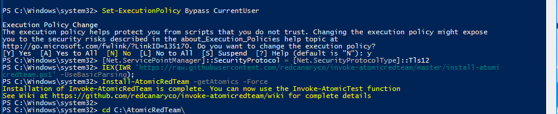

------------------------------------------------------------------------

# ⚙️ Custom Configuration
1️⃣ Windows Agent – Sysmon Log Collection

File:

C:\Program Files (x86)\ossec-agent\ossec.conf

Added:

```xml
<localfile>
  <location>Microsoft-Windows-Sysmon/Operational</location>
  <log_format>eventchannel</log_format>
</localfile>

<localfile>
  <location>Security</location>
  <log_format>eventchannel</log_format>
</localfile>
```

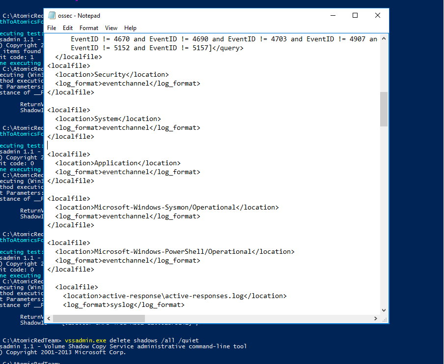

 Windows Audit Policy Enabled 
$ auditpol /set /subcategory:"Process Creation" /success:enable
$ gpupdate /force

Check 
gpedit.msc
→ Computer Configuration
→ Administrative Templates
→ System
→ Audit Process Creation
→ Include command line in process creation events = Enabled

🛡 Custom Wazuh Detection Rule

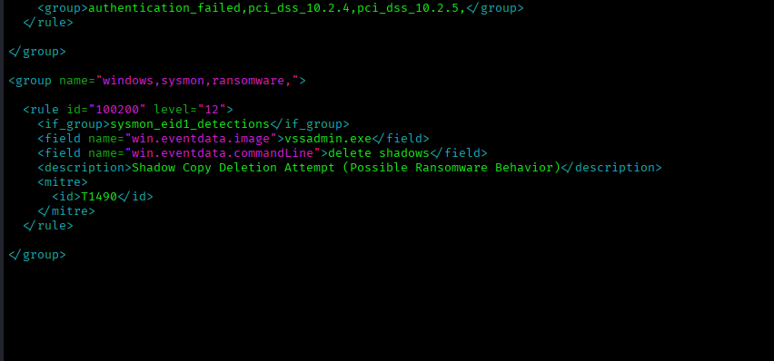
File:
```xml
/var/ossec/etc/rules/local_rules.xml
<group name="windows,sysmon,ransomware,">

  <rule id="100200" level="12">
    <if_group>sysmon_eid1_detections</if_group>
    <field name="win.eventdata.image">vssadmin.exe</field>
    <field name="win.eventdata.commandLine">delete shadows</field>
    <description>Shadow Copy Deletion Attempt (Possible Ransomware Behavior)</description>
    <mitre>
      <id>T1490</id>
    </mitre>
  </rule>

</group>

```
Restarted Wazuh:

systemctl restart wazuh-manager
------------------------------------------------------------------------
# 🧪 Attack Simulation
MITRE Technique:

T1490 – Inhibit System Recovery

Attack Command Executed:
$ Invoke-AtomicTest T1490 -ShowDetails

or 
manually trigger

$ vssadmin.exe delete shadows /all /quiet

if showing no files - Then create one
$ wmic shadowcopy call create Volume='C:\'
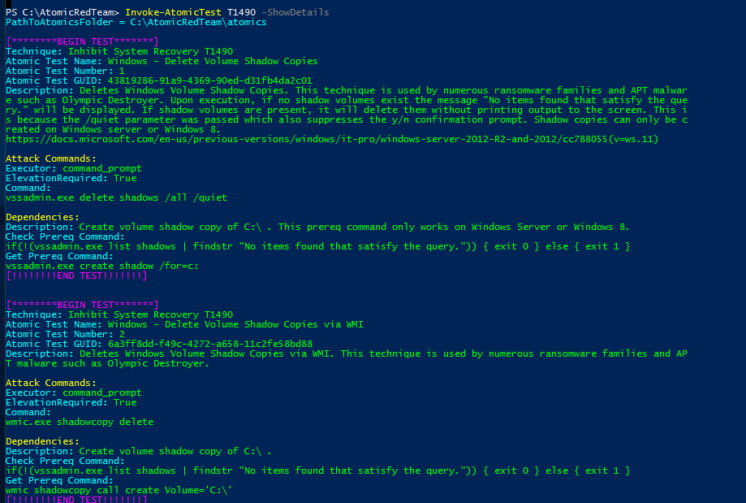

# Purpose:

Ransomware families commonly delete shadow copies to:

Prevent system restoration

Increase operational impact

Disable backup recovery options
------------------------------------------------------------------------
# 🔍 Detection Workflow

Attack command executed on Windows Server

Sysmon generated Event ID 1 (Process Create)

Event forwarded to Wazuh Manager

Custom rule triggered

Alert indexed in OpenSearch

MITRE mapping applied

Alert  received in dashboard

 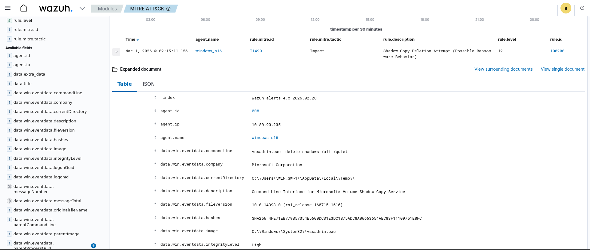

 wazuh -> Module -> MITRE ATT&CK
 ------------------------------------------------------------------------
# 📊 Detection Result

After executing the attack:

Field	              Value
Agent	              windows_s16
Rule ID	            100200
Level	              12 (High)
MITRE ID	          T1490
Tactic	            Impact
Technique	        Inhibit System Recovery

# ✅ Gate Check – Completed

✔ Ransomware technique simulated
✔ Alert generated
✔ MITRE ATT&CK mapping confirmed
✔ Kill Chain sequence visualized
✔ Detection visible in OpenSearch dashboard

# 🎓 Skills Demonstrated
Threat emulation using Atomic Red Team
Windows auditing configuration
Sysmon event analysis
Wazuh rule development
MITRE ATT&CK mapping
OpenSearch visualization
SOC detection validation workflow
------------------------------------------------------------------------
 # Challenges Faced ⚠ 
SSL/TLS Secure Channel Error
Issue:
While downloading Atomic Red Team from GitHub
Could not create SSL/TLS secure channel
Root Cause:
Older Windows Server versions do not enable TLS 1.2 by default.
Solution Applied:
Enabled TLS 1.2 to resolve secure channel error while downloading Atomic Red Team from GitHub
✔ Successfully resolved GitHub download issue.

 Initial Incorrect MITRE ATT&CK Mapping
Issue:
After executing T1490, alert was generated in Wazuh but mapped to:
T1059.003 (Windows Command Shell)
Instead of:
T1490 (Inhibit System Recovery)
Root Cause:
Default Wazuh rule matched generic command execution before specific behavior.
Solution:
Created custom rule matching:
vssadmin.exe
delete shadows
Mapped rule explicitly to MITRE T1490
Restarted Wazuh Manager
Re-ran simulation
✔ Alert correctly mapped to Impact tactic.

Understanding Prerequisites for Shadow Copy Deletion
Issue:
T1490 test requires an existing shadow copy.
If no shadow copy exists, command may return:
No items found that satisfy the query.
Solution:
Manually created shadow copy before executing attack:
✔ Ensured realistic ransomware simulation.
Week 4: ✅ Completed
------------------------------------------------------------------------
